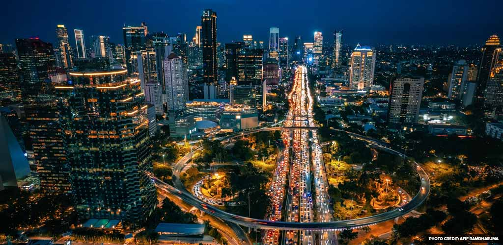

# May 5 — Fyrsta kvöldið í Jakarta

Ég lenti í Jakarta seint um kvöldið og hitinn skall á mér um leið og ég gekk út úr flugstöðinni — þungt, rakt loft sem maður næstum því drakk frekar en andaði að sér. Leigubíllinn mjakaðist í gegnum umferðina sem virtist aldrei sofa, mótorhjól smugu milli bílanna eins og fiskitorfur.

Hótelið mitt var í Menteng-hverfinu, og eftir stutta sturtu rölti ég út að finna eitthvað að borða. Á litlu götuhorni keypti ég nasi goreng af manni sem brosti breitt þegar hann sá hvað ég var óreyndur með chilipipar.

Fyrsta kvöldið í Suðaustur-Asíu, og ég var þegar kominn með tárin í augun — bæði af sterkum mat og af einhverri undarlegri tilfinningu þess að vera kominn verulega langt að heiman.
