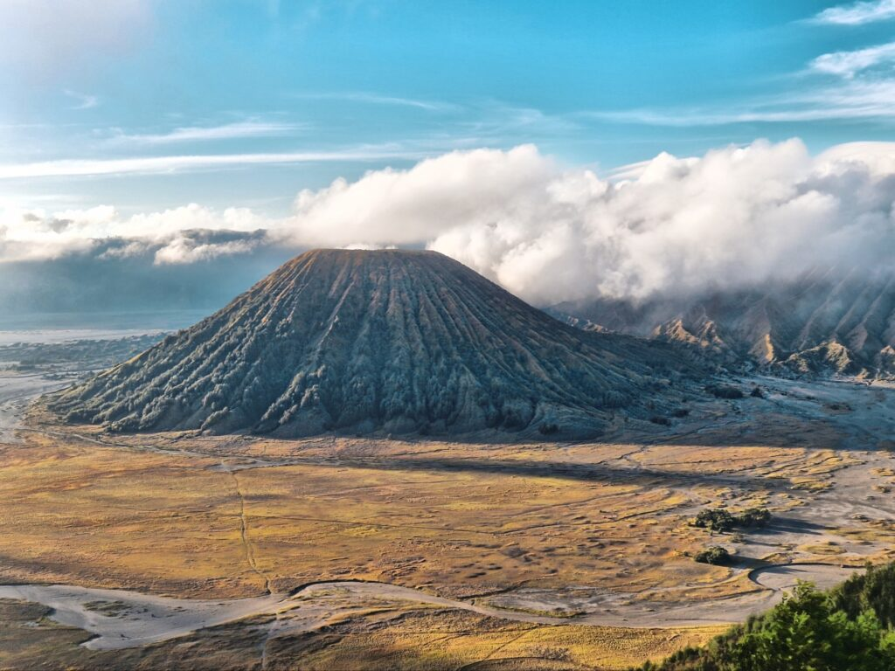

# May 7 — First Day in Jakarta

Ég vaknaði við köll bænakallarans frá nálægri mosku og ákvað að byrja daginn í Kota Tua, gamla hollenska nýlenduhverfinu. Fatahillu- og Café Batavia stóðu þar eins og tímavélar, og ég settist niður með kaffi sem var svo sterkt að það hefði getað vakið dáið fólk.

Seinna um daginn fór ég að Monas-turninum — þjóðminnismerki Indónesíu — og horfði yfir borgina sem teygði sig endalaust í allar áttir, byggingar og mosku-hvolfur svo langt sem augað eygði.

Um kvöldið lenti ég í samtali við nokkra heimamenn á litlu kaffihúsi nálægt hótelinu. Þeir hlógu að íslenskunni minni, ég hló að tilraunum þeirra til að bera fram „Eyjafjallajökull", og einhvern veginn skildum við hvort annað prýðilega. Ég gekk heim á hótelið með þá tilfinningu að Jakarta, þrátt fyrir allan hávaðann og ringulreiðina, væri í raun undarlega hjartahlý borg.

