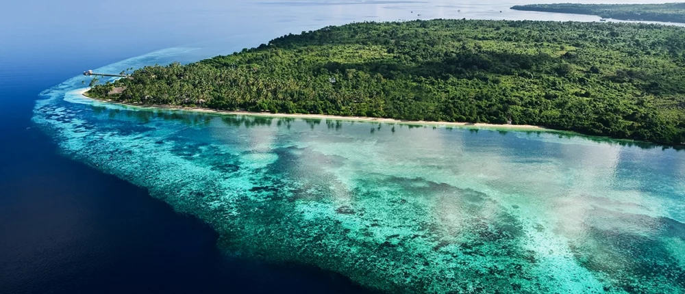

# Dagur 4 - Wakatobi Islands

Langt suðaustur af Sulawesi í Indónesíu liggur Wakatobi, eyjaklasi sem virðist næstum hannaður fyrir þá sem vilja hverfa úr hraða hversdagsins og niður í tærbláan sjó. Nafnið Wakatobi er myndað úr fjórum aðaleyjunum: Wangi-Wangi, Kaledupa, Tomia og Binongko. Svæðið er hluti af Wakatobi-þjóðgarðinum, stórum sjávarþjóðgarði í Suðaustur-Sulawesi.

Það sem gerir Wakatobi sérstakt er ekki aðeins hvítur sandur og pálmatré, heldur hafið sjálft. Eyjarnar eru í Kóralþríhyrningnum, einu líffræðilega fjölbreyttasta hafsvæði jarðar. UNESCO lýsir svæðinu sem vistkerfi með kóralrifum, sjávargrasi, mangrófum, fiskum, sjófuglum, skjaldbökum og sjávarspendýrum. Þar hafa verið skráðar um 590 fisktegundir, 396 kóralrifstegundir, 22 megintegundir mangrófa og 9 af 12 tegundum sjávargrass sem finnast í Indónesíu.

Fyrir kafara og snorklara er Wakatobi nánast draumur. Indonesia Travel segir að þar séu yfir 50 köfunarstaðir sem eru aðgengilegir frá helstu eyjunum, með jaðarrifum, hringrifum og varnarrifum. Vatnið er víða óvenju tært og landslagið undir yfirborðinu breytist frá grunnum kóralgörðum yfir í bratta veggi sem falla niður í dýpra haf.

En Wakatobi er ekki aðeins áfangastaður fyrir fólk með súrefniskút á bakinu. Hægt er að sigla milli eyja, ganga um þorp, fylgjast með daglegu lífi Bajo-sjómanna og njóta rólegra stranda þar sem ferðamannastraumurinn er minni en á þekktari stöðum eins og Balí. Á Wangi-Wangi er Sombu Beach meðal þekktari staða fyrir snorkl og sjóbað, og hún er tiltölulega nálægt Matahora-flugvelli.

Besti hlutinn við Wakatobi er líklega þessi tilfinning að vera komin á jaðar kortsins. Ferðin þangað getur tekið tíma, en einmitt það heldur svæðinu rólegra og náttúrulegra. Það er staður þar sem morguninn byrjar með ljósbláu hafi, dagurinn líður milli kóralrifa og kvöldið endar með sólsetri yfir eyjum sem virðast fljóta á milli Flores-hafs og Banda-hafs.

Wakatobi er því ekki bara „falleg eyja“ í hefðbundnum ferðabæklingaskilningi. Það er lifandi sjávarheimur, viðkvæmt vistkerfi og áminning um að bestu ferðastaðirnir eru stundum þeir sem krefjast þess að maður hægi aðeins á sér.

<!--youtube:BGr7LPyi_10-->

