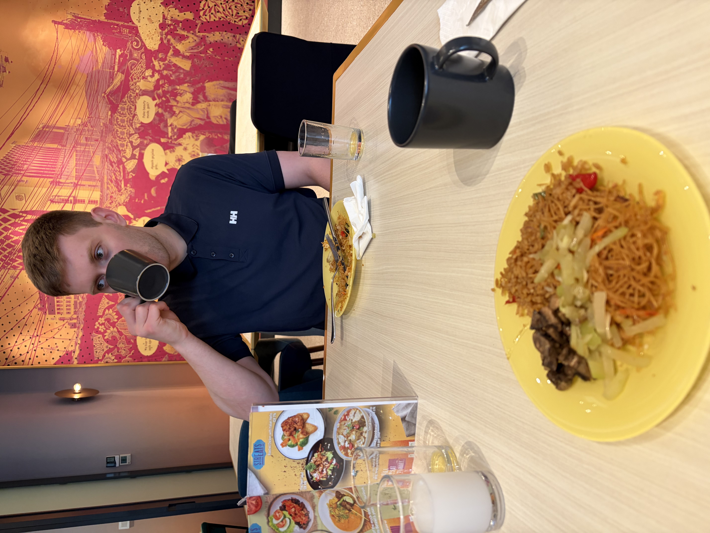
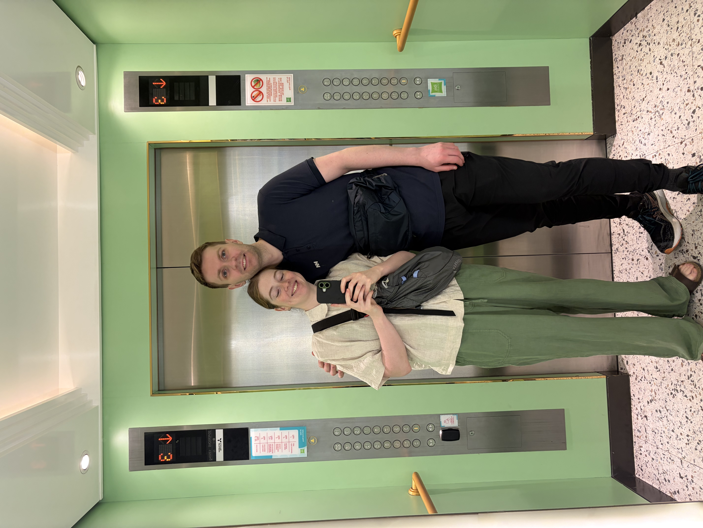
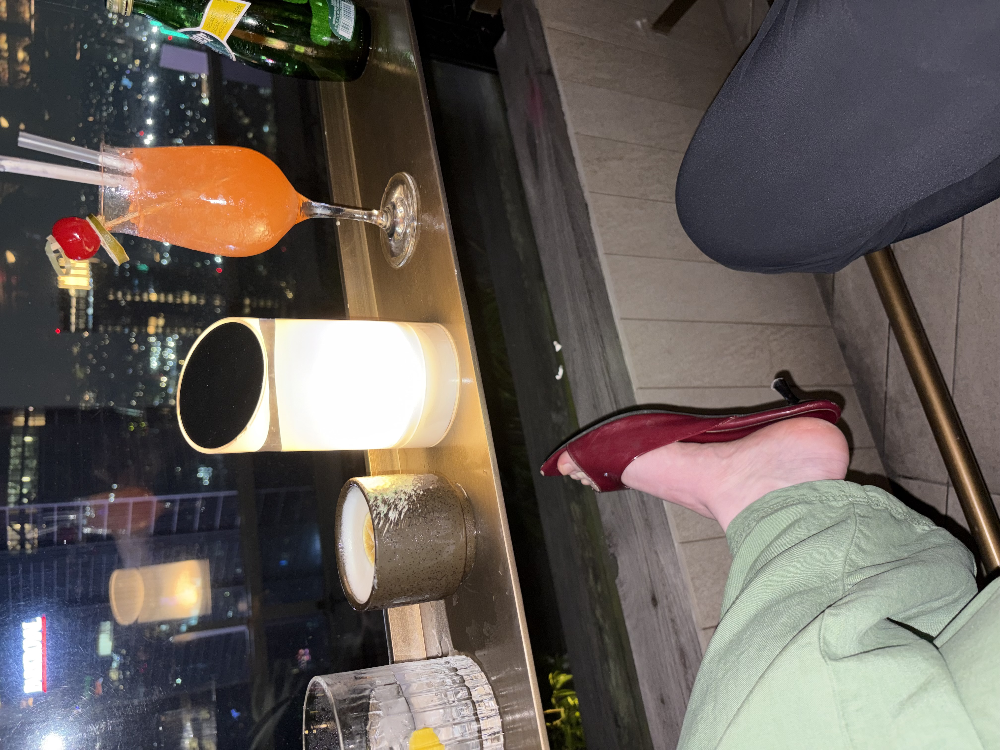

# Nasi goreng og skvísuskór

Eftir mjöög langt ferðalag sem gekk þó smurt fyrir sig lentum við í Jakarta, höfuðborg Indónesíu seint að kvöldi. Við kynntumst frábærum Jakartabúa, Joe, í síðasta flugleggnum, hann gaf okkur hin ýmsu ráð og staði til að skoða í stutta stoppinu í Jakarta, við spjölluðum og hlógum mikið sem stytti okkur stundir!

Dagurinn byrjaði á nasi goreng, kaffi og hvíld. En við héldum að við værum ekkert svo þreytt eftir ferðalagið, annað kom í ljós þegar morgunmaturinn var liðinn. Við nýttum því heitasta tíma dagsins í hvíld og fórum svo a vappið um miðborg Jakarta með leigubílum og fótgangandi þegar leið á seinnihlutann.

Samkvæmt Joe og því sem við höfðum lesið okkur til um, eru moll ein helsta afþreying margra Jakartabúa. Við komum stutt við í Grand Indonesia mollinu, sem líktist öllum öðrum mollum sem við höfum komið í áður, loftræstingin var vissulega næs í hitanum og rakanum og Laufey var á fóninum fyrir gesti og gangandi.

Þar á eftir kíktum við í Jalan Sabang sem er gata/svæði sem þekkt er fyrir street food, þar eftir langaði okkur að fá góða yfirsýn yfir borgina frá Monas en þar var lokað svo við fórum á einstaklega fínan rooftop bar þar sem dressið okkar rétt slapp inn um dyragættina svo lengi sem India Bríet skipti um skó (Birkenstocks fengu falleinkunn) barinn reddaði glæsilegum rauðum skvísuskóm að eigin frumkvæði og við gátum því notið útsýnis og drykks yfir þessa óendanlega stóru borg sem hýsir 42 milljónir íbúa sem gerir hana að fjölmennustu borg í heimi.

