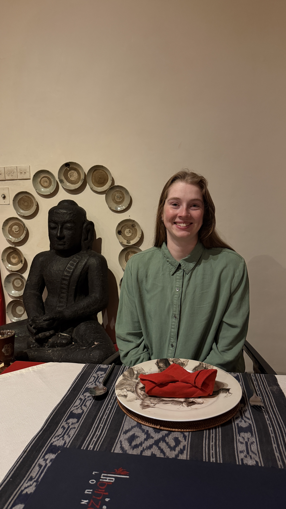
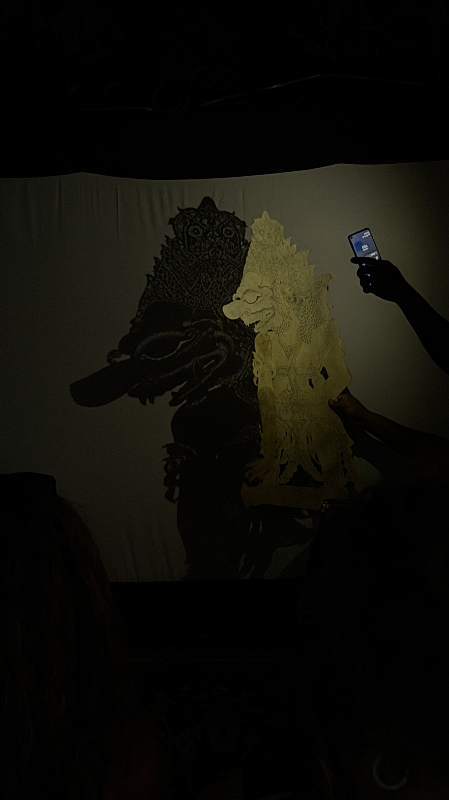
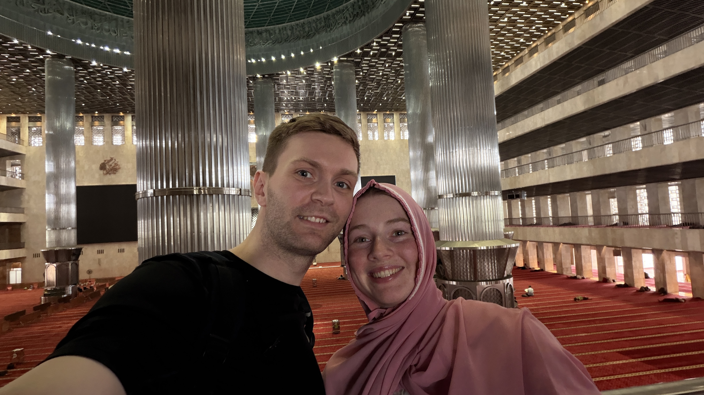
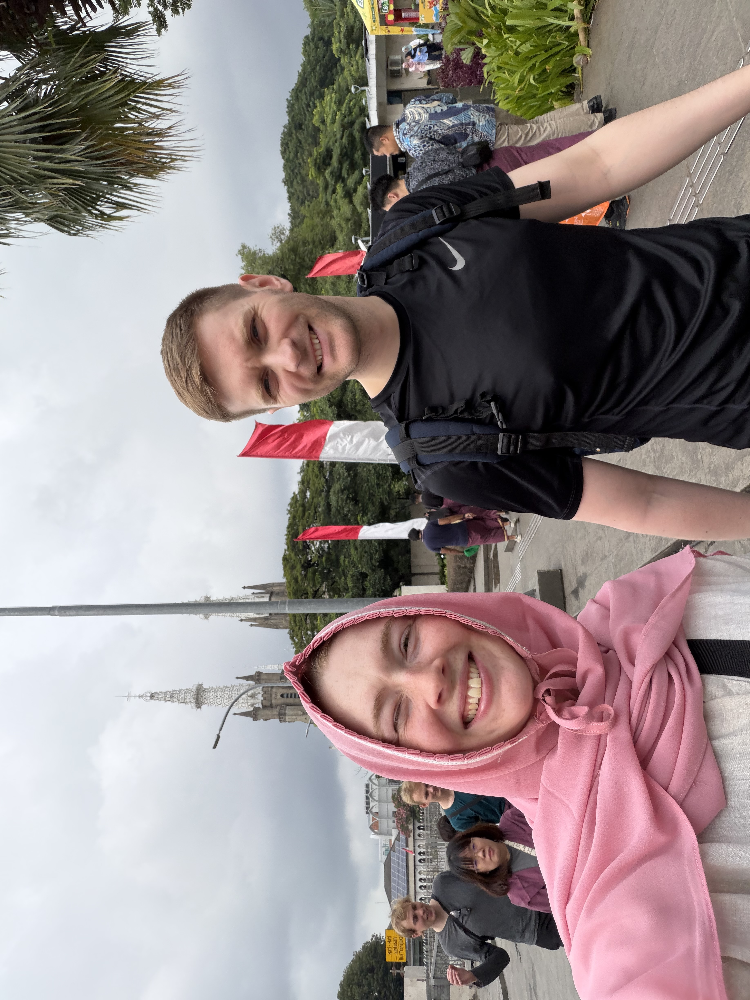
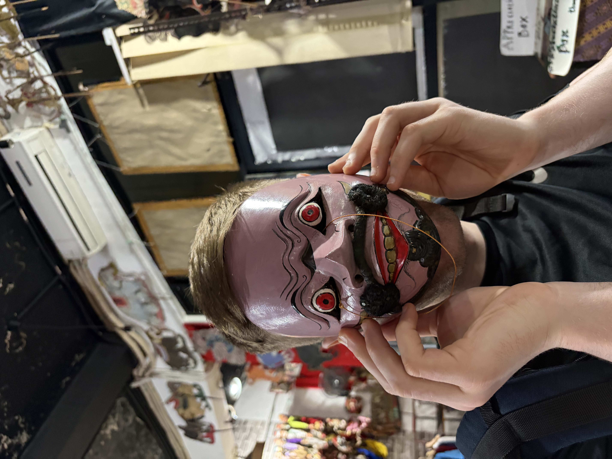
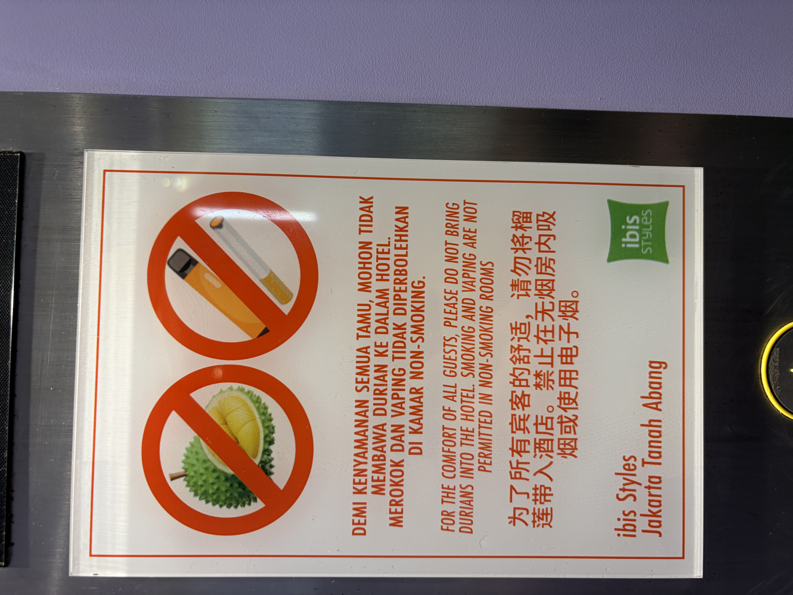

# Gus og Gun

Það er ýmissa áhrifa að gæta í morgunverðarboðinu, bakaðar baunir, hollenskt súkkulaði kurl á brauð ásamt hefðbundnum indónesískum mat. Smökkuðum bubur kacang hijau sem kom mjög á óvart og mælum með.

Í dag gengum við kaótískar götur í mallandi hita og raka að Pasar Tanah Abeng sem er lokal markaður á 12 hæðum með allskyns þemum, í raun eins og moll í formi völundarhúss. Við fórum þangað m.a. í leit að moskító neti fyrir áframhaldandi ferðalag, sölufólkið var mjög brosmilt og hjálplegt og beindi okkur dýpra og dýpra inn í völundarhúsið, þar sem við römbuðum svo að lokum fram á réttan bás, þar var EITT risastórt neon bleikt moskítónet, það eina sem var til sölu á markaðnum! Netið var þó á stærð við pop up tjald og hentaði okkur því ekki. Við græddum þó mjög skemmtilegan leiðangur þar sem við sáum mannlífið og inn í hversdagleika þeirra sem ekki versla í fínu merkjavöru mollunum.

Eftir hádegi komu Gus og Gun að sækja okkur. Gun sá um að keyra okkur um víðan völl og hleypa okkur inn/út út bílnum eins og hefðarfólki sæmir okkur ekki til ánægju en létum okkur hafa það af virðingu við Gun.
Gus fræddi okkur um helstu kennileiti, staði, pólitík og menninguna hér í Jakarta og almennt í Indónesíu.

Viðkomustaðir dagsins voru Monas sem er 132m hár minnisvarði um baráttu Indónesíu fyrir sjálfstæði (17.8.1945), Istiqlal (sjálfstæði) moskan sem er stærsta moska í suðaustur asíu en þar geta 200.000 manns komið saman og beðið. Á móti henni er kaþólks dómkirkja ásamt protestant kirkju. Byggingarnar standa þrjár saman til að sýna fram á samlífi þessara trúarbragða í indónesísku samfélagi.

Eins og í gær þá féll India Bríet á dresskóðanum, ekki var að óttast því moskan útdeilir hijab, skópoka og síðum klæðum ef þess er þörf. Kristján var tip top í dressinu og IB fékk lánaða bleikan hijab sem rímaði vel við húðtóninn. Þar völsuðum við um á tánum og sokkunum og virtum fyrir okkur þessa áhugaverðu byggingu.

Þar eftir stoppuðum við í gamla miðbænum, sem er mjög innblásinn af nýlendutíma Hollendinga, fórum við á brúðusafn, drukkum indónesískt kaffi (Ache og Flores Bajawa) og smökkuðum eftirrétt með dorian ávextinum sem er svo lyktsterkur að hann er bannaður á hótelinu okkar og smakkast allt í lagi.

Úrhelli rigning var í nokkra stund sem hjálpar ekki borginni sem sígur/sekkur um 25cm á ári sem sást vel við höfnina þar sem yfirborð sjávar var hærra en landið sjálft og aðskilið með steyptum vegg. Síðan tók við keyrsla og spjall tilbaka á hótelið og mjög gott padang padang í kvöldmat eftir skemmtilegan og lærdómsríkan dag.

Áhugavert dagsins: einstaklingar í Jakarta kjósa að standa í miðju umferðaröngþveiti og reyna að stýra umferðinni í von um að fá þjórfé frá bílstjórum, hægt er að þéna meira á mánuði við umferðarstjórnun en við hefðbundið skrifstofustarf.

Yfirvöld hyggjast flytja höfuðstöðvar Indónesíu frá Jakarta til Kalimantan vegna landsigs, en það er okkar næsti áfangastaður. Næsta uppfærsla verður þaðan.

