# Báturinn Prince (5-8. maí)

Við yfirgáfum Jakarta 5. maí og flugum til Pangkalan Bun, bær í Central Kalimantan. Þar vorum við sótt af Kyu, sem guide-inn okkar næstu fjóra daga í bátsferð um Tanjung Puting þjóðgarðinn meðfram Sekonyer ánni. Yndislega teymið á bátnum okkar Prince samanstóð af Kyu guide, kokknum Sue, skipstjóranum Ian og aðstoðarmanninum Madan.

Fyrsti dagurinn var rólegur. Við sigldum langleiðina inn í tropical heath skóginn, bátnum var lagt í árbakkanum, kvöldmaturinn var borinn fram og svefnplássinu slegið upp. Á leiðinni sáum við alls konar dýrategundir, meðal annars macaques apa, krókódíl og snák!

Teymið hugsaði alveg einstaklega vel um okkur þessa fjóra daga á meðan ferðinni stóð, allar máltíðir og millimál voru mjög góð. Indónesískar bananapönnukökur, ferskvatnsfiskur, alls kyns soðið eða gufusoðið grænmeti, núðluréttir, fried rice (nasi goreng), tempeh, tófú og alls kyns ávextir og ljúffengt engifer og lemongrass te.

Næstu þrír dagar einkenndust síðan af alls konar ævintýrum og dýralífi. Þar má nefna að við sáum órangúta, probiscis og macaque apa í trjánum meðfram ánni, fylgdumst með því þegar landverðir færðu órangútönum banana og sætar kartöflur að borða, við fórum í næturrölt í gegnum hitabeltisskóginn (exposure therapy fyrir hræðilegum dýrum), þar sem við sáum ólíkar furðuverur, tarantúlur, sporðdreka, risa maura, drekaflugur og eldflugur svo eitthvað sé nefnt, við vorum vel hulin fyrir dýrunum á meðan landvörðurinn var klæddur í flipflops og gróf sig inn í hreiður sporðdrekans með fingrunum einum. Þess á milli slökuðum við á um borð í bátnum á siglingu í gegnum hitabeltisskóginn meðfram Sekonyer ánni.

Á einum tímapunkti þegar við vorum að rölta í skóginum urðum við vitni að orangútan að leika sér á jörðinni aðeins nokkra metra frá okkur. Órangútar eru mjög forvitin dýr, hann gekk alltaf nær og nær og allt í einu stóð hann aðeins einum metra frá okkur, Indiu Bríet og Kye, Kye var tilbúin með bangsasnák til að kasta til hans ef hann myndi koma að okkur þar sem órangútar eru mjög hræddir við slöngur, en Kye hefur einstakan áhuga á skriðdýrum. Okkur fannst þetta pínu óþægilegt þar sem ráðlagt er að halda sér 5m frá dýrunum en en á sama tíma alveg mögnuð upplifun að komast svo nálægt!
Það eru varla til orð ti

Næturnar í moskítótjaldinu okkar minntu á infrarauðar saunastundir með austurevrópskt hardbase teknó í forgrunni þar sem allt dýraríkið var á djamminu allan liðlanga nóttina (og daginn).

Núna sitjum við í bátnum, komin aftur í netsamband og á leið til baka í bæinn Pangkalan Bun. Við erum bæði sammála um að þessi ferð sé eitthvað það magnaðasta sem við höfum upplifað og ef einhver er á þessum slóðum þá mælum við klárlega með þessu. Þangað til næst

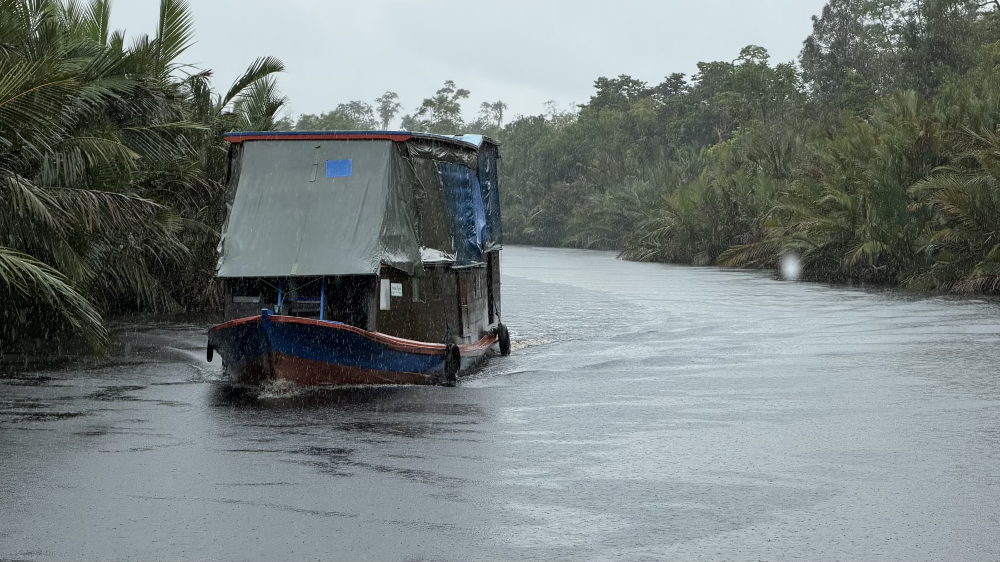

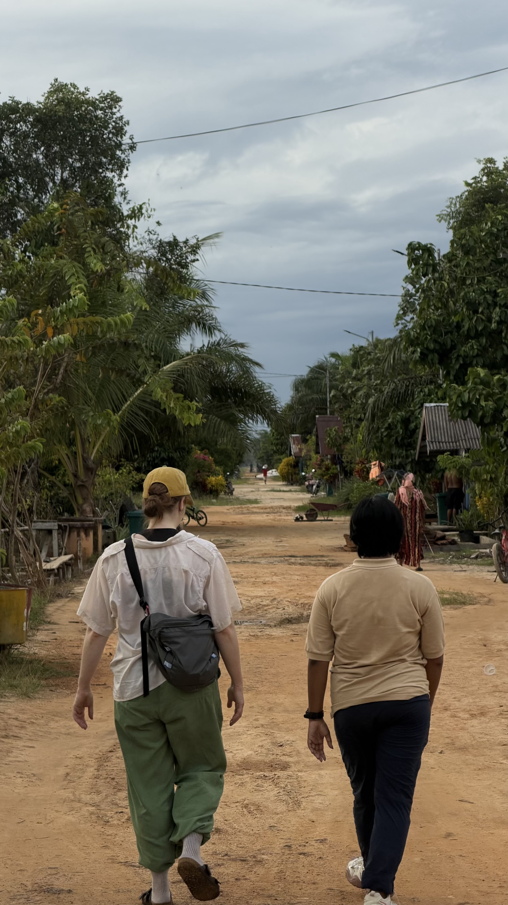

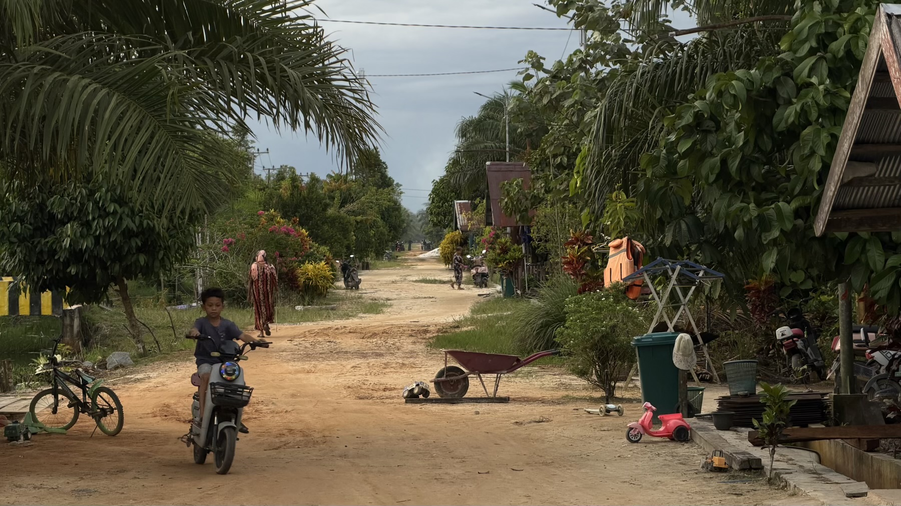

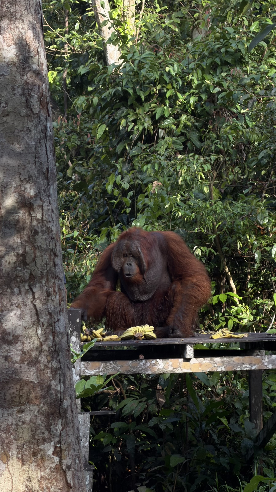

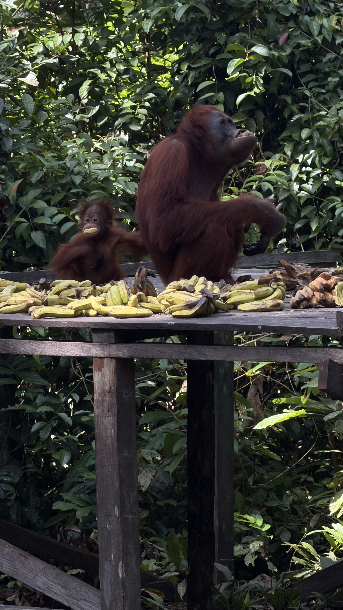

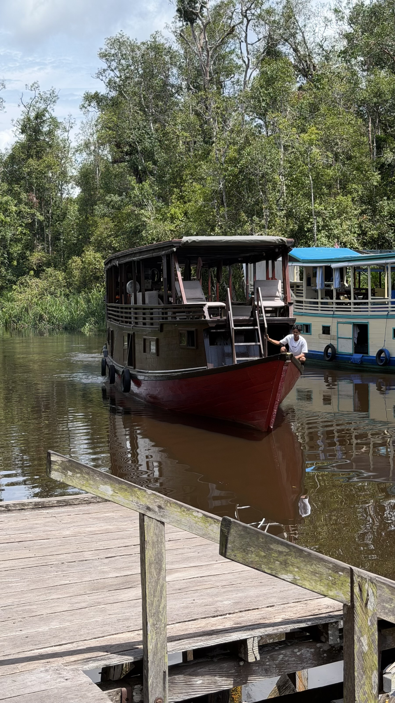

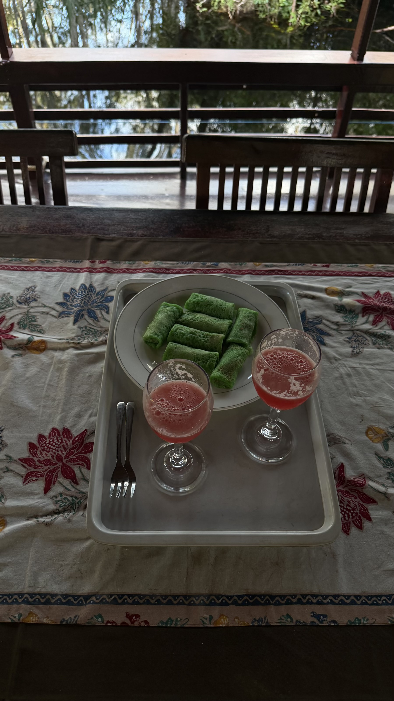

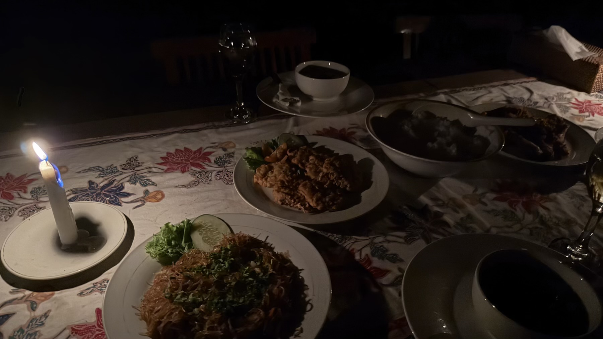

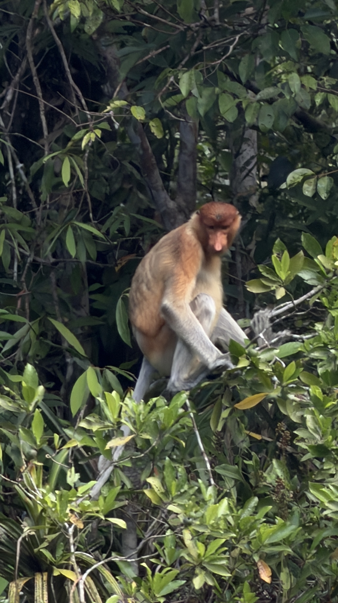

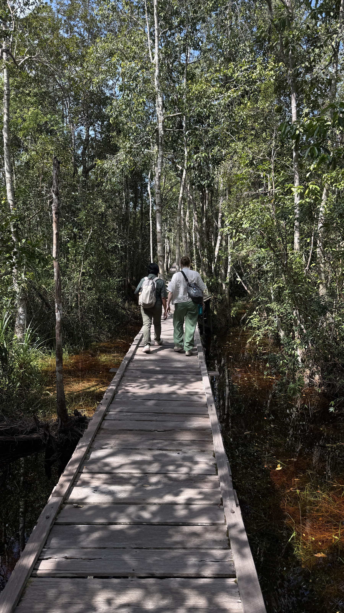

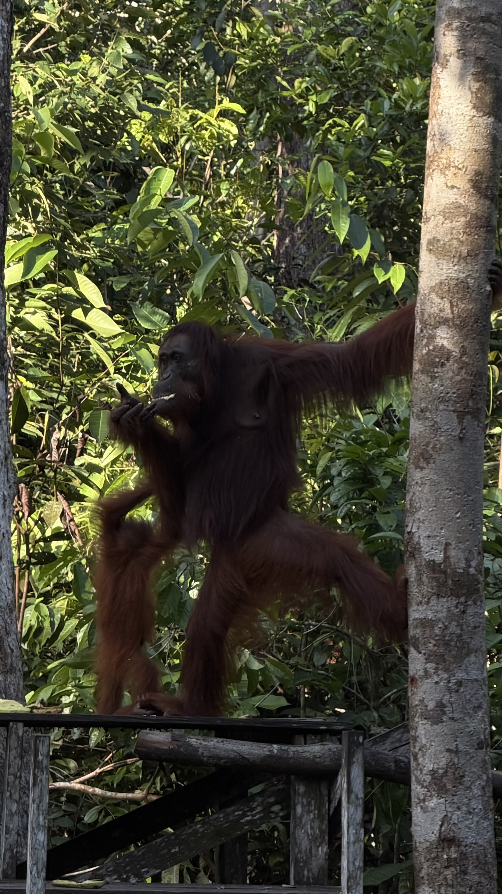

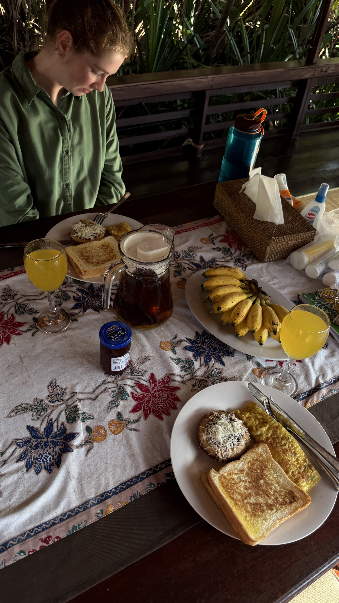

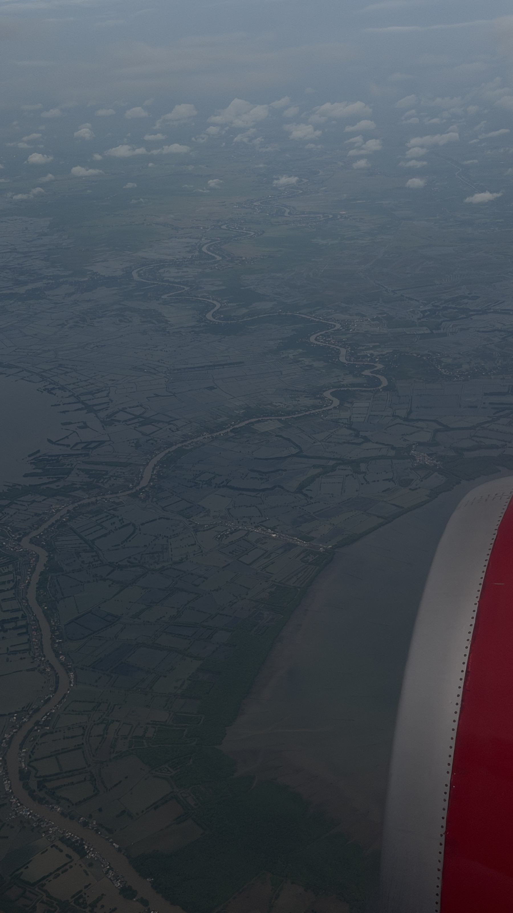

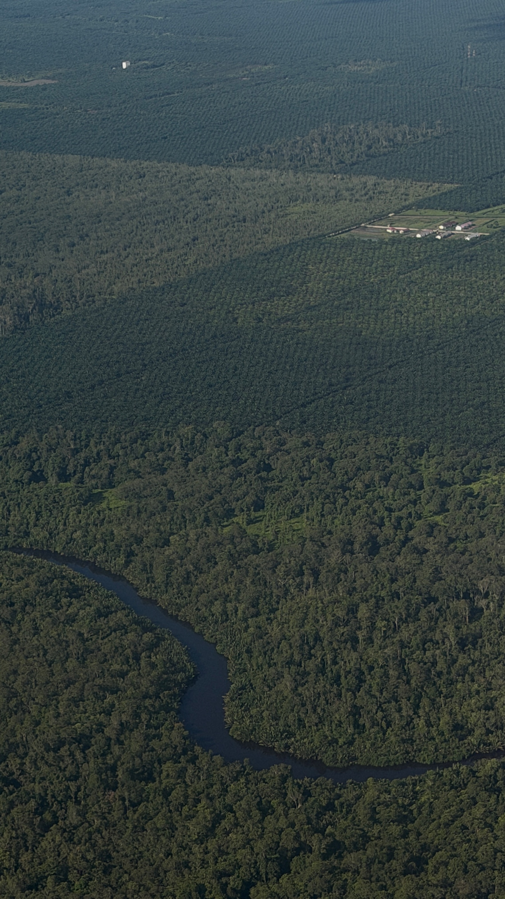

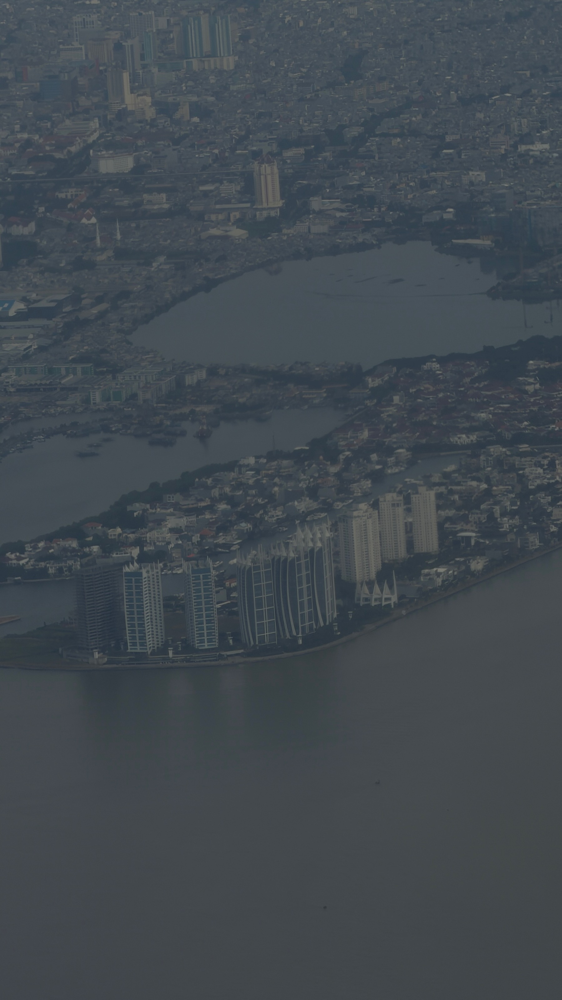
